# Pokemon Emporium

## Milestone Project 2 - Interactive Front-End Site

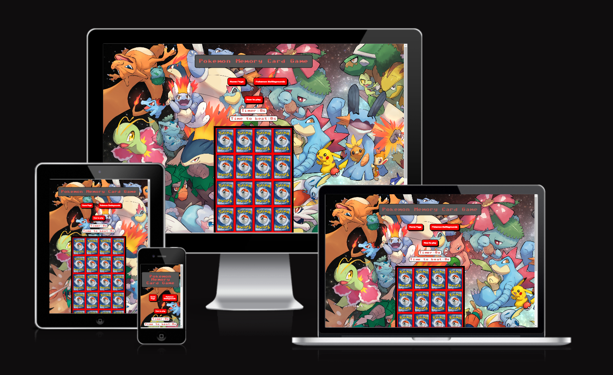

- The Pokemon Emporium is aimed at children from ages 5 onwards as well as anyone who has a keen interest in Pokemon. It features a memory card game which will contain authentic cards, which will allow the user to gain a score. It will also feature a Pokedex allowing the user to access Pokemon details.
- This is my Milestone Project 2 submission for Code Institutes Diploma in Web Application Development Course. My website features 3 webpages and is built using HTML, CSS and JavaScript.

## Project Link

[View the live project here](https://fraserr1188.github.io/Pokemon-Emporium/index.html)

## Repository

[Find the project repository](https://github.com/FraserR1188/Pokemon-Emporium)

# Table of Contents

## Contents

1. [User Stories](#user-stories)
	* [Game Users](#game-users)
	* [Parents](#parents)
	* [Pokemon Fanatics](#pokemon-fanatics)
	* [Business Owner](#business-owner)

3. [Design](#design)
	* [Typography](#typograhy)
	* [Images](#images)
	* [Colour Scheme](#color-scheme)
	* [Wireframes](#wireframes)
	* [Icons](#icons)

4.  [Features](#features)
	* [Existing features](#exisiting-features)
	* [Features left to implement](#features-left-to-implement)

5. [Technologies used](#technologies-used)

6. [Testing]

7. [Deployment](#deployment)
	* [Creating a Gitpod Workspace](#creating-a-gitpod-workspace)
	* [GitHub Pages](#github-pages)
	* [Forking the GitHub Repository](#forking-the-github-repository)
	* [Making a Local Clone](#making-a-local-clone)

8. [Credits](#credits)
	* [Content]
	* [Media]
	* [Code]
	* [Acknowledgements]

## Project Goals
This website is dedicated to the love of Pokemon and targets to main fanbases, Pokemon Cards and also the game itself with the Pokedex aspect. The memory card is light hearted with a timer and a time to beat rather than a countdown timer to make less stressful and more fun to play and also to play again.

There is also a section on the website called Pokemon Battlegrounds where the user and come and pick three Pokemon and fight against the computer. 

## User Stories
#### Game Users:

These are users who like to spending time playing causal games whether they like Pokemon or not.

- As a game user, I would like have a timer counter.
- As a game user, I would like to have smooth transitions when selecting the cards.
- As a game user, I would to have an eye-catching website to draw me in and make me want to play more than one game.
- As a game user, I would to play on any device.
- As a game user, I would to have a helpful reminder on how to play the game if I get stuck.
- As a game user, I would like some sort of competition between the computer and myself to keep me enticed.
- As a game user, I would like to be able to pick from a list of Pokemon which I can fight with.
- As a game user, I would like to have a range of attack moves which I can use against the computer.

#### Parents:

These are the parents of younger children who may be concerned of their child playing games online.

- As a parent, I would like if the website was children friendly.
- As a parent, I would like to be able to contact the business owners of the website in case I have any queries or problems.

#### Pokemon Fanatics

These are users who are avid Pokemon hobbyists and have a keen interest in all things Pokemon.

- As a Pokemon fanatic, I would like to see a variation of Pokemon cards which I can play with.
- As a Pokemon fanatic, I would like to to be able to pick my own Pokemon team and fight against an oppenent.
- As a Pokemon fanatic, I would like to see pictures of the Pokemon I select and attack moves which are genuine to the Pokemon themselves.
- As a Pokemon fanatic, I would like to see that genuine Pokemon cards are used in the memory card game.
- As a Pokemon fanatic, I would like to pick from the original 150 Pokemon to fight with.
- As a Pokemon fanatic, I would like to see a picture of the Pokemon I choose.

#### Business Owners

These are the owners of the website

- As a business owner, I want my website to accessible and user friendly on any device.
- As a business owner, I want my website to have links to social media outlets.
- As a business owner, I want people to learn more about Pokemon in a fun way.
- As a buisness owner, I would want scablitily and room for more features to be implemented.
 
## Design
### Typography

- The main font which I'll use throughout the website is Sixtyfour Convergence which is obtained from Google Fonts. This type of font has a retro-gaming vibe which I feel would go well with the gaming style of website. I will use Sans Serif as a fall back font.
- There won't be much text on the website but if I feel that the main font doesn't read well. I use Roboto Mono as this still has a retro vibe but is more readable.

### Images
- Images are a main criteria throughout the website. The main memory card game will comprise of 20 cards (10 pairs) which I will obtain from the official TCG website.
- Images for the Pokedex section will come from Pokemon API which will be shown inside the Pokemon Battlegrounds.

### Colour Scheme
The colours which are present throughout are as follows:

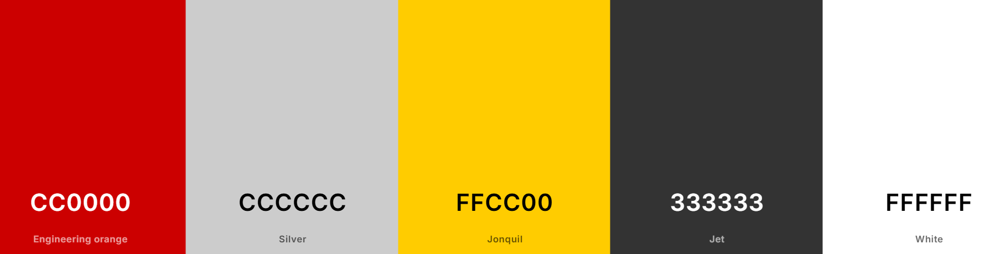

I used as the red and yellow for the Pokemon theme but the blue was too harsh for UX. The other colours worked well with the website. 

### Wireframes
These are the wireframes which I based my project around.

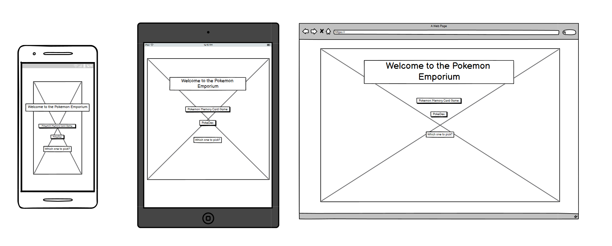

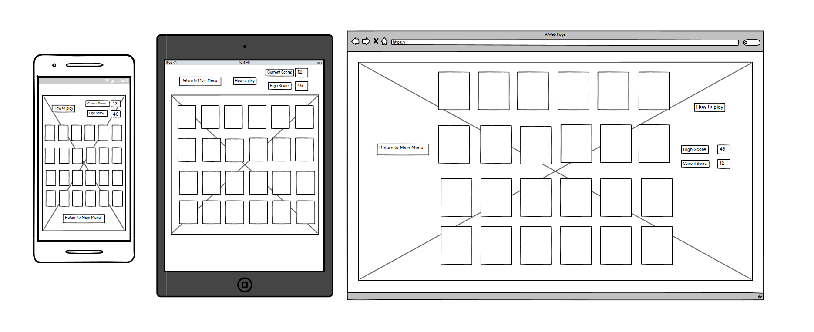

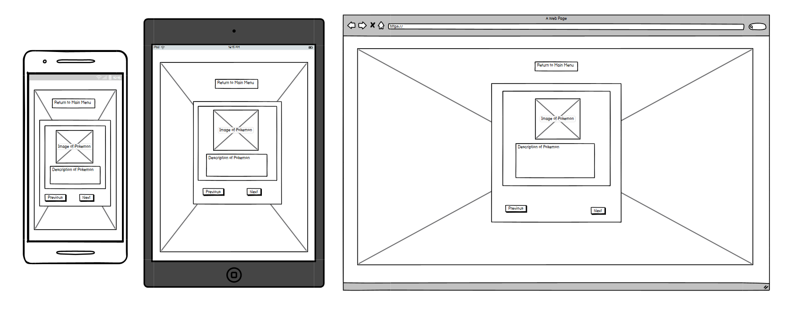

The final wireframe shown here was drastically changed during development. Me and my mentor had a discuss to make it more interactive and went from a static display of a Pokedex to a Battleground. The extended the development but definitely makes it more enjoyable for the user.

### Icons
I used these specific images for the footer to keep with the gaming feel of the project.

## Features

### Existing Features

#### Homepage

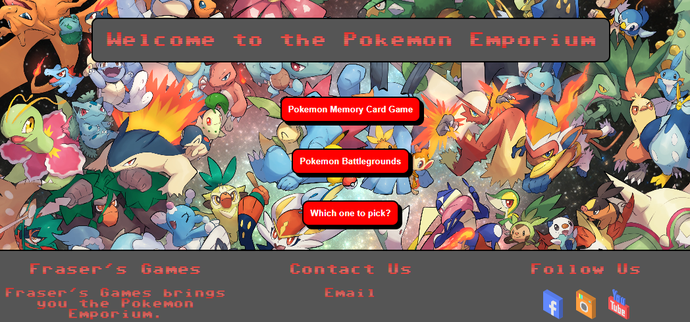

- This is the homepage which allows the user to access either the Memory Card game or the Battlegrounds game.

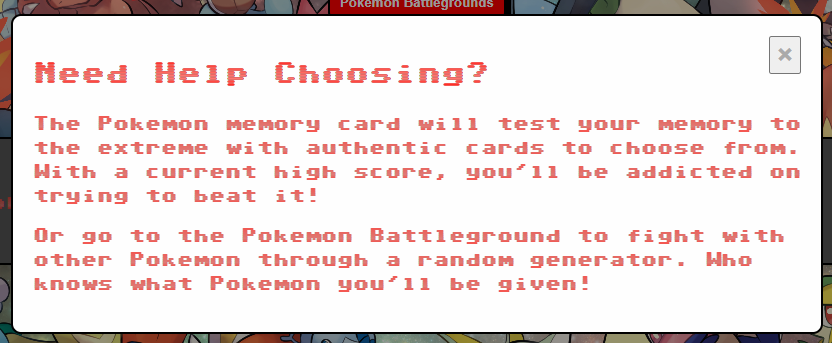

- There a modal "Which one to pick?" which explains to the user what each game is about.
- I intended on having buttons in the middle of the screen to centre the user's attention.

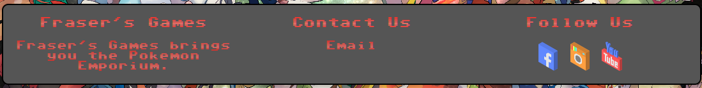

- This also has the footer which is present on all pages.

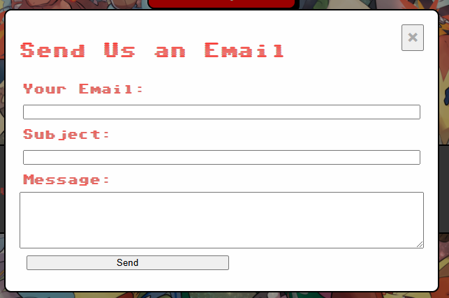

- There is also an email modal which is present in the footer across all pages which is for any user to submit information regarding the website. Good or bad!

#### Pokemon Memory Card Game:

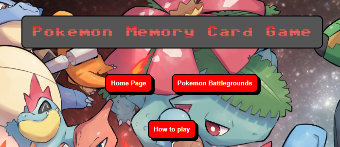

- These are the navigation buttons which allow the user to go back to index/home page or tavel through to the Battlegound page and continue the adventure.

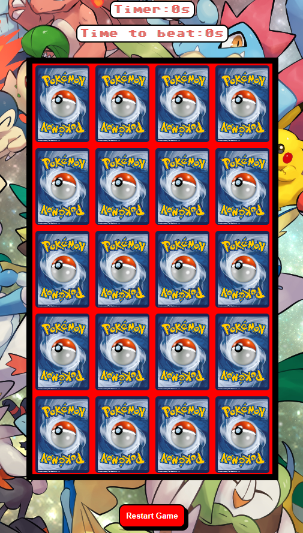

- The game features 10 different cards (within the JavaScript this is x2 so there are 10 pairs) which are facing back to the user. When clicked on the card flips through a smooth transition.
- Once the first card is flipped the timer starts and once the last pair have matched the timer stops and logs the time for the player to try and beat.
- There is also a reset button in case the player wants to start again any time throughout playing.

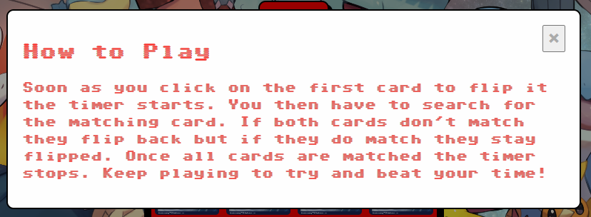

- This is a help modal which explains to the user how to play the game.

#### Pokemon Battlegrounds:

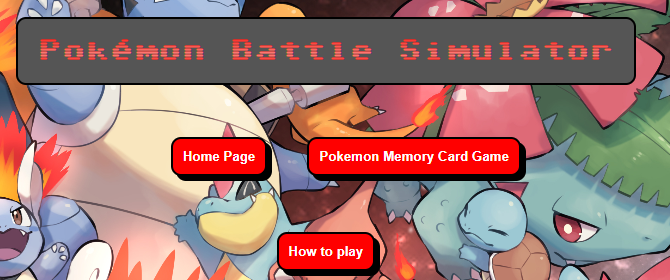

- These are the navigation buttons which allows the user to go back to memory card game or go to the home page. It also has the help modal.

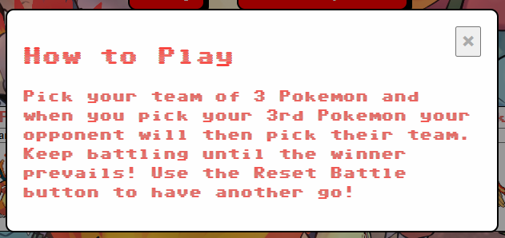

- This is the help modal which explains to the user how the game works.

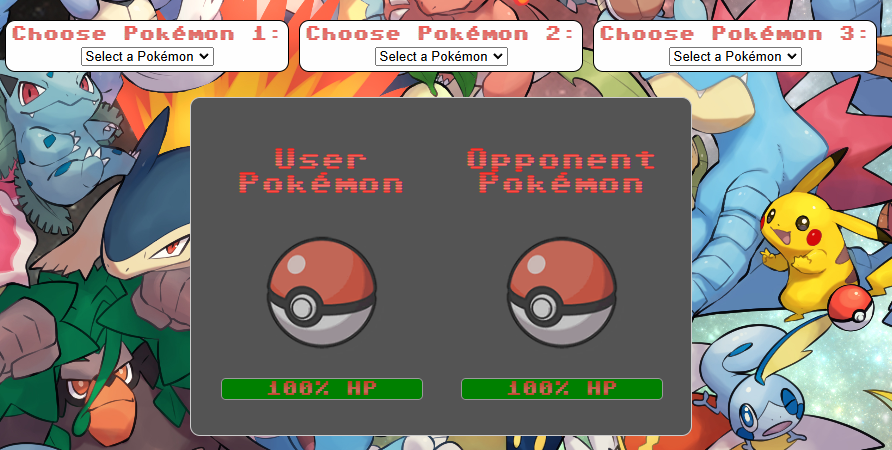

- This game will ask the user to select 3 Pokemon from a dropdown box in which they can use to fight/interact with the computer.
- Once the user selects the Pokemon a sprite will appear, the user can keep changing until they select the last of the 3 and then the battle will commence.
- The game is turn-based and the user will have the option of 4 attack moves to use against the computer.
- The attacks will go back and forth until the team's last Pokemon has fainted and then a message will pop up in the battle logs saying who won.
- There is a reset button which allows the user to battle again.

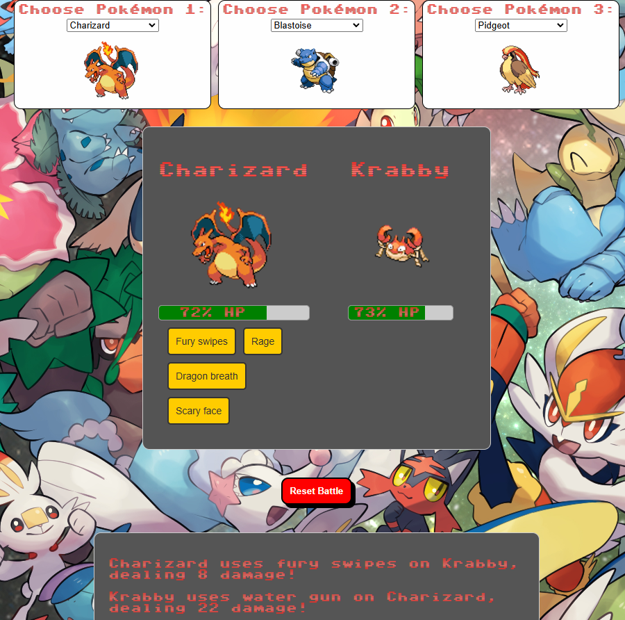

- This is what the game looks like when the previous steps are in motion.

### Future Features
#### Pokemon Memory Card Game:

- A future feature could be that an API could hold a lot of players times and have a leaderboard.
- Have difficulty settings with more cards, medium with 15 cards and hard with 20 cards etc...

#### Pokemon Battlegrounds:

## Technologies Use
### Languages Used
- [HTML5](https://en.wikipedia.org/wiki/HTML5)
- [CSS3](https://en.wikipedia.org/wiki/CSS)
- [JavaScript](https://en.wikipedia.org/wiki/JavaScript)
### Frameworks Libraries and Programs
- [Google Fonts](https://fonts.google.com/)
	- I used the Sixtyfour Convergence.
- [CloudConvert](https://cloudconvert.com/)
	- I used this online image converter to change my images from PNG to AVIF.
- [Scheme Color](https://www.schemecolor.com/)
	- I used this website to obtain the classic colours for the Pokemon theme.
- [Github](https://github.com/)
	- This is where I create and store the repository.
- [Gitpod](https://gitpod.io/)
	- This is what I used to create my folders and code.
- [Icons8](https://icons8.com/icons)
	- This is where I obtained my icons from for my social media links.
- [Balsamiq](https://balsamiq.com/)
	- Where I created my wireframes for the project.
- [Google Chrome Dev Tools](https://www.google.com/chrome/dev/)
	- I used this for debugging and respsonsiveness throughout the project build.
- [Coolors](https://coolors.co/)
	- I used this website to create the palette for the coloures which are used in the project.
- [Alpha Coders](https://alphacoders.com/pokemon-4k-wallpapers)
	- This is where I obtained the background image used throughout the website.
-  [TCG Pokemon Card Website](https://www.pokemon.com/us/pokemon-tcg/pokemon-cards)
	- This is where I obtained all the cards used in the Memory Card game.

### Application Programming Interface (API's)

- [The RESTful Pokemon API](https://pokeapi.co/?ref=public-apis)
	- I used the RESTful Pokemon API to obtain the data for the Pokemon Battlegrounds including sprites/attack moves/types.

## Testing 

- Please refer [here](TESTING.md) for all the information regarding testing of the Pokemon Emporium Website.

## Deployment

### Creating a Gitpod Workspace

The project was created in Gitpod using the Code Institute Gitpod Full Template as follows:

1. Log in to GitHub and go to the [Code Institute student template for Gitpod](https://github.com/Code-Institute-Org/gitpod-full-template)
2. Click 'Use this Template' next to the Green Gitpod button.
3. Add a repository name and click 'Create reposiory from template'.
4. This will create a copy of the template in your own repository. Now you can click the green 'Gitpod' button to open a workspace in Gitpod.

### GitHub Pages

The project was deployed using GitHub pages as follows:

1. Log in to GitHub and go to the [GitHub Repository](https://github.com/FraserR1188/Pokemon-Emporium)
2. Locate the Navbar at the top of the Repository (not top of page). Click the Settings tab.
3. Locate the Navbar on the left hand side of the page. Click the "Pages" section (under 'Code and automation').
4. Under "Source", click the dropdown called "None" and select "main". Click save.
5. The page will automatically refresh.
6. A notification will appear at the top of the page with the [link](https://github.com/FraserR1188/Pokemon-Emporium/blob/main/index.html) to the deployed site. You can return to this GitHub Pages section to access the link.

### Forking the GitHub Repository

Forks are used to propose changes to someone else's project or to use someone else's project as a starting point for your own idea. By forking the GitHub Repository you make a copy of the original repository on our GitHub account to view and/or make changes without affecting the original repository.

To Fork a Github Repository:

1. Log in to GitHub and go to the [GitHub Repository](https://github.com/FraserR1188/Pokemon-Emporium)
2. Locate the Fork button in the top-right corner of the page, click Fork.
3. You should now have a copy of the original repository in your GitHub account.

### Making a Local Clone

You will now have a fork of the repository, but you don't have the files in that repository locally on your computer.

To clone this project into Gitpod you will need:
1. A Github account. Create a Github account here. [https://github.com/](https://github.com/)
2. Use the Chrome browser.

Then follow:

1. Log in to GitHub and locate the [GitHub Repository](https://github.com/FraserR1188/Pokemon-Emporium)
2. Then select Code button and then under the Local tab copy the link in the HTTPS tab.
3. Open Git Bash.
4. Change the current working directory to the location where you want the cloned directory to be made.
5. Type git clone, and then paste the URL you copied in step 3.
6. Press Enter. Your local clone will be created.

More a more in-depth process click [here.](https://docs.github.com/en/pages/getting-started-with-github-pages/creating-a-github-pages-site)

## Credits
- I used W3C schools and Stackover Flow for further understanding from the content through the Code Institute.

Problems with the memory card game:

In the memory card game I've had trouble accessing the location of the card sourcing.
I originally thought this problem was focused in the startGame function but it was actually in the selectCard function and the card1Selected.src file path was board[r][c] but it should of been what it was right now.

Once i thought the game was finished. After selecting the second card the game would stop. This was due to mentioned card1Selected twice in the selectCard function.

issues with the index.html. Created a hidden-div to stop the footer overlapping the buttons on a mobile view.
