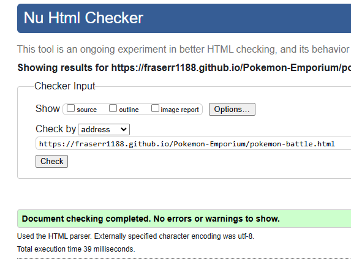
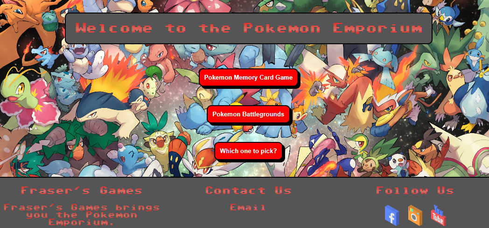

# Testing

The Pokemon Emporium has been tested using the following methods:

1. [Code Validation](#code-validation)
    - [W3C HTML Validator](#w3c-html-markup-validator)
    - [W3C CSS Validator](#w3c-css-validator)
    - [JSHINT Javascript Code Quality Tool](#js-hint-code-quality-tool)
2. [Google Lighthouse](#google-lighthouse)
3. [Responsiveness](#responsivenss)
4. [A11y Color Contrast Accessibility Checker](#a11y-color-contrast-accessibility-checker)
5. [Browser Compatibility](#browser-compatibility)
6. [Testing User Stories](#testing-user-stories)
    - [Game Users](#game-users)
    - [Parents](#parents)
    - [Pokemon Fantatics](#pokemon-fanatics)
    - [Buisness Owners](#business-owners)
7. [Manual Testing](#manual-testing)
    - [Index Page](#index-page)
    - [Pokemon Memory Card Game](#pokemon-memory-card-game)
    - [Pokemon Battle Simulator](#pokemon-battle-simulator)
8. [Peer Review](#peer-review)
9. [Bugs](#bugs)

# Code Validation

## W3C HTML Markup Validator

All testing was carried out by the W3C Validator tool which can be accessed [here](https://validator.w3.org/)

### Index Page

### Memory Card Game Page

### Battleground Page

## W3C CSS Validator

Testing for the website's CSS was carried out through the W3C CSS Validator which can be accessed [here](https://jigsaw.w3.org/css-validator/)

## JS Hint Code Quality Tool 

### index.js

### memory.js

### battle.js

## Google Lighthouse

### index.html

This is the testing result on a desktop.

This is the testing result on a mobile.

### pokemon-memory.html

### pokemon-battle.html

This is the testing result on a desktop.

This is the testing result on a mobile.

## A11y Color Contrast Accessibility Checker

## Browser Compatibility

The site was tested in Google Chrome, Microsoft Edge, Mozilla Firefox and Opera on desktop.

The site was tested in Google Chrome and Safari on mobile.

No issues arose during browser testing. CSS transitions worked on all browsers tested.

## Responsivenss

Responsivity tests were carried out using Google Chrome DevTools. Device screen sizes covered include:

- iPhone SE
- iPhone XR
- iPhone 12 Pro
- Pixel 5
- Samsung Galaxy S8+
- Samsung Galaxy S20 Ultra
- iPad Mini
- iPad Air
- Surface Pro 7
- Surface Duo
- Galaxy Fold
- Samsung Galaxy A51/71
- Nest Hub
- Nest Hub Max

I also personally tested the website on iPhone 13, iPhone 11 and MSI gaming PC with a dual screen.

## Testing User Stories

### Game Users

- As a game user, I would like have a timer counter.
    - There is a timer counter present in the Pokemon Memory Card Game which starts when the first card is flipped.
    - A time to beat section is there as well to make the player stay to compete with themselves.
- As a game user, I would like to have smooth transitions when selecting the cards.
    - I have implement custom CSS to have a smooth transition animation when the game user selects a card.
- As a game user, I would to have an eye-catching website to draw me in and make me want to play more than one game.
    - The main picture in the background through-out the website is of a range of Pokemon which is nice to look at.
    - Buttons which are present have a nice effect on them which is pleasing to use.
    - The font has a retro gaming vibe which would add to the effect.
- As a game user, I would to play on any device.
    - This website has been tested on several devices and browsers which allows playability anywhere.
- As a game user, I would to have a helpful reminder on how to play the game if I get stuck.
    - How to play modals are present on both sections of the website.
    - Navigation help modal is also present on the home page.
- As a game user, I would like some sort of competition between the computer and myself to keep me enticed.
    - The Memory Card game has a self competition from the time-to-beat section.
- As a game user, I would like to be able to pick from a list of Pokemon which I can fight with.
    - A dropdown list is used on the Battle Simulator which allows the user to select from 150 Pokemon.
- As a game user, I would like to have a range of attack moves which I can use against the computer.
    - There are attack moves which the user can select from the what level the Pokemon is.

### Parents

- As a parent, I would like if the website was children friendly.
    - This is a child friendly website which contains easy to understand helpful hints and straightforward user design.
- As a parent, I would like to be able to contact the business owners of the website in case I have any queries or problems.
    - There are email access modals on every page within the footer of the website.

### Pokemon Fanatics

- As a Pokemon fanatic, I would like to see a variation of Pokemon cards which I can play with.
    - There are a variation of different Pokemon present within the deck that is present in the game.
- As a Pokemon fanatic, I would like to to be able to pick my own Pokemon team and fight against an oppenent.
    - There are 3 Pokemon selection points which enable the user to select what Pokemon they want.
- As a Pokemon fanatic, I would like to see pictures of the Pokemon I select and attack moves which are genuine to the Pokemon themselves.
    - When the user selects a Pokemon an image appears of the Pokemon.
    - When the fight starts attacks moves are present and are also genuine to that type of Pokemon.
- As a Pokemon fanatic, I would like to see that genuine Pokemon cards are used in the memory card game.
    - The cards which are used have been taken from the TCG database which is offical Trading Card Game website.
- As a Pokemon fanatic, I would like to pick from the original 150 Pokemon to fight with.
    - When the user selects on the dropdown list, only the original 150 can be selected.

### Business Owners

- As a business owner, I want my website to accessible and user friendly on any device.
    - This website is accesible on all devices and scores above 94 on the accessibility section in the Lighthouse testing.
- As a business owner, I want my website to have links to social media outlets.
    - There are links in the footer for social media outlets.
- As a business owner, I want people to learn more about Pokemon in a fun way.
    - The imgary helps with this. User's can see the Pokemon that they want to fight with which gives a visual representation.
    - The attack moves also give a better understanding of the Pokemon.
- As a buisness owner, I would want scablitily and room for more features to be implemented.
    - The Battle Simulator can allow more Pokemon in a team.
    - The Battle Simulator could keep score of how many battles have taken place and who's won what.
    - The Memory Card Game could have a difficulty mode e.g. easy, medium and hard, scaling with how many cards are present on the table.

## Manual Testing

### Index Page

- The two navigation buttons work and take the user to their destination.
- The third button, which is a help modal, works and pops up in the middle of the page. To close it the user can click outside of it or click/touch the cross.
- In the Contact Use section of the footer the Email modal works and pops up. Once the correct fields have been filled in the user will send the email and an alert pops up.
 - Also within the footer there are social icons which do a cool pop up animation when hovered over. When clicked the user will be taken to the relevant social platform.

### Testing table for Pokemon Memory Card Game

| **Test Case ID** | **Feature/Module**        | **Description**                         | **Steps to Test**                                                                 | **Expected Result**                                    | **Status** | **Comments**          |
|-------------------|---------------------------|-----------------------------------------|----------------------------------------------------------------------------------|-------------------------------------------------------|------------|-----------------------|
| TC001             | Game Board Rendering      | Verify the game board is displayed.     | 1. Load the memory card game page.                                              | Cards are displayed in a grid, all face down.         | ✅   |                       |
| TC002             | Card Flip                | Ensure a card flips when clicked.       | 1. Click on a face-down card.                                                   | Card flips to reveal Pokémon image.                   | ✅   |                       |
| TC003             | Match Detection          | Check if matching cards stay flipped.   | 1. Flip two cards with matching Pokémon images.                                  | Matching cards remain face up.                        | ✅  |                       |
| TC004             | Mismatch Behavior        | Verify non-matching cards flip back.    | 1. Flip two cards with different Pokémon images.                                 | Cards flip back face down after a delay.              | ✅    |                       |
| TC005             | Game Completion          | Check game ends when all pairs match.   | 1. Match all pairs on the board.                                                | Timer stops, and game completion is indicated.        | ✅   |                       |
| TC006             | Restart Game             | Ensure restart resets board and timer.  | 1. Click "Restart Game".                                                        | All cards reset to face down; timer restarts.         | ✅   |                       |
| TC007             | Responsive Layout        | Verify layout on various devices.       | 1. Open game on desktop, tablet, and mobile.                                     | Elements align correctly and are accessible.          | ✅    |                       |
| TC008             | Help Modal               | Test "How to play" modal functionality. | 1. Click "How to play" button. 2. Close modal with "X".                       | Modal opens with instructions; closes correctly.      | ✅    |                       |
| TC009             | Email Modal              | Test email modal form validation.       | 1. Click "Email" link. 2. Fill and submit form.                               | Modal opens; required fields validated; form submits. | ✅    |                       |
| TC010             | Timer Functionality      | Verify timer starts and stops.          | 1. Start flipping cards. 2. Match all pairs.                                  | Timer starts on first flip; stops when game ends.     | ✅   |                       |
| TC011             | Best Time Tracking       | Ensure "Time to beat" updates.          | 1. Complete the game with a faster time.                                         | "Time to beat" updates with the new best time.        | ✅    |                       |
| TC012             | Mismatch Interaction     | Test flipping during mismatch delay.    | 1. Flip two mismatched cards. 2. Click a third card during animation.         | Game ignores input during mismatch animation.         | ✅    |                       |
| TC013             | Restart During Play      | Test restarting mid-game.               | 1. Flip a few cards. 2. Click "Restart Game".                                 | Game resets without errors.                           | ✅    |                       |
| TC014             | Navigation Buttons       | Verify navigation buttons redirect.     | 1. Click "Home Page". 2. Click "Pokemon Battlegrounds".                      | Buttons redirect to the correct pages.                | ✅   |                       |
| TC015             | Social Media Links       | Check social media links functionality. | 1. Click each social media link in the footer.                                   | Links open in new tabs and lead to correct pages.     | ✅   |                       |

### Testing table for Pokemon Battle Simulator

| **Test Case ID** | **Feature/Module**        | **Description**                         | **Steps to Test**                                                                 | **Expected Result**                                    | **Status** | **Comments**          |
|-------------------|---------------------------|-----------------------------------------|----------------------------------------------------------------------------------|-------------------------------------------------------|------------|-----------------------|
| TC016             | Navigation Buttons       | Verify navigation buttons redirect.     | 1. Click "Home Page". 2. Click "Pokemon Memory Card Game".                    | Buttons redirect to the correct pages.                | ✅ / ❌    |                       |
| TC017             | Help Modal               | Test "How to play" modal functionality. | 1. Click "How to play" button. 2. Close modal using the "X" button.           | Modal displays instructions and closes correctly.     | ✅ / ❌    |                       |
| TC018             | Pokémon Selection        | Verify Pokémon selection dropdowns.     | 1. Select a Pokémon from the dropdown. 2. Preview updates to match selection. | Selected Pokémon and preview image display correctly. | ✅ / ❌    |                       |
| TC019             | Selection Completion     | Test behavior after selecting 3 Pokémon.| 1. Select three Pokémon. 2. Wait for opponent Pokémon selection.              | Opponent's Pokémon are displayed after user's.        | ✅ / ❌    |                       |
| TC020             | Pokémon Display          | Check Pokémon display in battle arena.  | 1. Select Pokémon. 2. Start the battle.                                       | User and opponent Pokémon images and names display.   | ✅ / ❌    |                       |
| TC021             | Battle Mechanics         | Test battle logic for attacks.          | 1. Choose an attack from user moves. 2. Verify opponent's HP decreases.       | Attack reduces opponent's HP; battle logs update.     | ✅ / ❌    |                       |
| TC022             | Reset Button             | Ensure battle resets on button click.   | 1. Click "Reset Battle".                                                        | Battle resets; Pokémon selection cleared.             | ✅ / ❌    |                       |
| TC023             | HP Bar Updates           | Verify HP bar reflects Pokémon health.  | 1. Use attacks to reduce HP. 2. Check if HP bar updates correctly.            | HP bar decreases proportionally to damage.            | ✅ / ❌    |                       |
| TC024             | Battle Logs              | Ensure battle logs update correctly.    | 1. Perform attacks during the battle.                                           | Logs show move details, damage, and turn outcomes.    | ✅ / ❌    |                       |
| TC025             | Responsive Layout        | Verify layout on various devices.       | 1. Open game on desktop, tablet, and mobile.                                     | Elements align correctly and are accessible.          | ✅ / ❌    |                       |
| TC026             | Social Media Links       | Check social media links functionality. | 1. Click each social media link in the footer.                                   | Links open in new tabs and lead to correct pages.     | ✅ / ❌    |                       |
| TC027             | Pokémon Images           | Verify Pokémon preview and battle images.| 1. Select Pokémon. 2. Start battle. 3. Check preview and battle images.    | Correct Pokémon images display throughout.            | ✅ / ❌    |                       |
| TC028             | Accessibility            | Check keyboard navigation.              | 1. Navigate using `Tab` key. 2. Interact with buttons and dropdowns.          | All elements are keyboard accessible.                 | ✅ / ❌    |                       |
| TC029             | Opponent AI              | Verify opponent Pokémon behavior.       | 1. Complete user Pokémon selection. 2. Monitor opponent AI moves.            | Opponent selects moves and executes attacks.          | ✅ / ❌    |                       |
| TC030             | Error Handling           | Check for invalid Pokémon selection.    | 1. Attempt to proceed without selecting Pokémon. 2. Observe behavior.         | Game prevents progression until 3 Pokémon are chosen. | ✅ / ❌    |                       |
| TC031             | Reset During Battle      | Test resetting mid-battle.              | 1. Start a battle. 2. Click "Reset Battle" before the battle ends.            | Game resets without errors or interruptions.          | ✅ / ❌    |                       |
| TC032             | Footer Links             | Verify footer links navigate correctly. | 1. Click on "Contact Us" and "Follow Us" links. 2. Check destinations.        | Links lead to the appropriate pages or actions.       | ✅ / ❌    |                       |

## Peer Review

## Bugs
